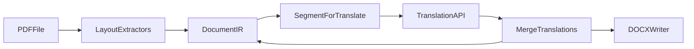

# PDF to DOCX Translator Implementation Plan

## Project Goal
- Build a desktop app that translates Thai PDF content to English DOCX while preserving structure (reading order, columns, tables, and run-level styling when extractable).
- Keep architecture extensible so v2 can support English to Thai with minimal changes.

## Scope and Milestones
- **v1:** Text-based Thai PDF to English DOCX with sensible reading order, real Word tables where possible, and style-preserving runs.
- **v2:** Add configurable language direction (including English to Thai) and Thai-friendly DOCX font defaults.

## Status Board

Legend: `TODO` = not started, `IN_PROGRESS` = actively building, `DONE` = completed, `BLOCKED` = waiting on dependency/decision.

- `DONE` `bootstrap-repo` - Create standalone repo, pyproject, src/tests scaffold, and baseline README.
- `DONE` `define-ir` - Implement IR dataclasses with stable IDs and JSON debug serialization.
- `TODO` `build-extractors` - Implement PyMuPDF text/style extraction, column ordering, and pdfplumber table extraction.
- `TODO` `translation-layer` - Implement provider adapter, chunking, batching/retries, and merge-by-ID.
- `TODO` `docx-export` - Build DOCX writer for paragraphs/runs/tables with font mapping fallbacks.
- `TODO` `desktop-ui` - Implement PySide6 UI with background worker, progress, logs, and settings.
- `TODO` `tests-fixtures` - Add fixture PDFs and regression tests for ordering, tables, and DOCX structure.
- `TODO` `package-release` - Package macOS app and finalize README with limitations and setup.
- `TODO` `v2-followup` - Add EN to TH language selector and Thai font defaults without refactoring core pipeline.

## Design Philosophy: Modularity + OOP

### Core principles
- Use small, focused modules with clear boundaries so each subsystem can be developed and tested independently.
- Use OOP for stateful workflows (extractors, translators, exporters, worker orchestration) and dataclasses for data models.
- Prefer dependency inversion: higher-level orchestration depends on interfaces, not concrete vendors/libraries.
- Keep transformation logic deterministic and side-effect free where practical, so tests stay fast and stable.

### Module ownership and responsibilities
- `src/ir/`: Domain models and schema-like structures (document/page/block/run/table/cell), no external API calls.
- `src/extract/`: PDF parsing and layout analysis (PyMuPDF spans + pdfplumber tables), outputting only IR objects.
- `src/translate/`: Translation provider client(s), chunking, retries, and ID-based merge back into IR.
- `src/export/`: DOCX rendering from IR only, including paragraph runs and Word table generation.
- `src/ui/`: UI concerns only (inputs, progress, logs, worker lifecycle), delegating business logic to services.

### OOP structure (conceptual)
- `DocumentExtractor` interface with concrete extractors (`PyMuPDFExtractor`, `PdfPlumberTableExtractor`).
- `ReadingOrderResolver` strategy class (gap-based or k-means implementation variants).
- `TranslationProvider` interface with concrete provider adapters (`GoogleTranslator`, `AzureTranslator`, `DeepLTranslator`).
- `TranslationOrchestrator` service to segment, batch, translate, and merge by stable IDs.
- `DocxExporter` service to write Word content from IR with font mapping policy objects.
- `PipelineRunner` (used by UI worker) to coordinate extract -> translate -> export with progress callbacks.

### Why this helps development
- You can replace one piece (for example translator provider or column detection strategy) without touching the rest.
- Bugs are easier to isolate because each class has a single responsibility.
- Test failures directly map to one module and one behavior.

## Testing Philosophy (Build-and-Verify Loop)

### Test pyramid for this app
- **Unit tests:** IR dataclasses, chunking logic, reading-order sort function, font mapping, retry policy behavior.
- **Integration tests:** extractor -> IR, translator mock -> merge, IR -> DOCX XML structure.
- **End-to-end tests:** sample PDF -> translated DOCX with expected structure and key content checks.

### Practical workflow while building
1. Implement one module in isolation.
2. Add/adjust unit tests for that module first.
3. Run module-level integration test with fixture inputs.
4. Move to the next module only after green tests.
5. Periodically run end-to-end fixture tests to catch pipeline regressions.

### Suggested fixture strategy
- Keep small synthetic PDFs in `tests/fixtures/` for:
  - single-column reading order
  - two-column reading order
  - paragraph + table mixed layout
  - style-rich text spans.
- Snapshot normalized IR JSON for extraction checks.
- Validate DOCX structure by parsing document XML for paragraphs/runs/tables rather than pixel-perfect visual comparison.

## Architecture (Data Flow)

## Implementation Phases

### Phase 0: Repository and project bootstrap
- Create standalone repository and open it as active workspace.
- Initialize Python project metadata/dependencies in `pyproject.toml`.
- Scaffold directories:
  - `src/ir`
  - `src/extract`
  - `src/translate`
  - `src/export`
  - `src/ui`
  - `tests`
- Add baseline docs in `README.md` (setup, API key setup, v1 non-goals).
- Add quality tooling and minimal CI (lint + tests).

### Phase 1: Core domain model (IR)
- Define dataclasses:
  - `Document`, `Page`, `Block` union (`ParagraphBlock`, `TableBlock`)
  - `Run` with `text`, `bold`, `italic`, `font_name`, `size_pt`
  - `Table` and `Cell` with stable IDs for translation mapping
- Add JSON serialization helpers for debugging and snapshots.
- Add IR unit tests.

### Phase 2: PDF extraction pipeline
- Implement text extraction with PyMuPDF using block bounding boxes and span style metadata.
- Implement per-page reading-order resolver:
  - gap-based or k-means clustering on `x0`
  - sort by `(column, y, x)`
- Integrate table extraction using pdfplumber `find_tables()`.
- Avoid duplicate content where text blocks overlap table regions.
- Add regression fixtures and tests for tricky ordering.

### Phase 3: Translation subsystem
- Implement one provider adapter first (Google, Azure, or DeepL).
- Build segmenter with stable IDs preserving style boundaries.
- Add batching, retry/backoff, and rate-limit handling.
- Merge translated text into IR by stable IDs.
- Add robust logging and partial-failure safeguards.

### Phase 4: DOCX export
- Build DOCX writer:
  - paragraphs with run-level style mapping
  - tables with row/cell mapping
  - optional page breaks between pages
- Add PDF-font to Word-font fallback mapping.
- Add structural DOCX tests (XML-level checks).

### Phase 5: Desktop UI (PySide6)
- Build main window with:
  - input PDF picker
  - output DOCX picker
  - v1 fixed language direction (TH to EN)
  - translate button, progress bar, and log panel
- Run pipeline in `QThread` worker to keep UI responsive.
- Add cancellation and clear error reporting.
- Add settings dialog for API credentials (env var minimum; keyring optional).

### Phase 6: Packaging and release readiness
- Add PyInstaller setup for macOS app packaging.
- Validate end-to-end flow on darwin with representative PDFs.
- Finalize README:
  - install/run/package instructions
  - API config
  - known limitations (scanned PDFs and OCR out of v1 scope)

### Phase 7: v1.1 hardening backlog
- Add per-page manual column override UI for misdetected layouts.
- Improve heuristics for uneven columns.
- Warn when tables likely span pages and may be split.

### Phase 8: v2 enablement (EN to TH)
- Add language-pair selector and shared direction parameter.
- Add Thai-capable DOCX font defaults with user override.
- Reuse same IR, extraction, and export pipeline.
- Expand tests for EN to TH and Thai font behavior.

## Acceptance Checklist (v1)
- Thai text-based PDF translates to coherent English DOCX.
- Multi-column reading order is sensible on known fixtures.
- Tables become real Word tables for supported patterns.
- Run-level style fidelity is preserved where extractable.
- UI remains responsive and provides progress + error visibility.

## Operating Rules During Development
- Prefer interfaces and dependency injection over hard-coded concrete classes.
- Avoid cross-layer imports that violate module boundaries.
- Keep public APIs small and explicit for each module.
- Update this status board whenever a task state changes to preserve project visibility.
